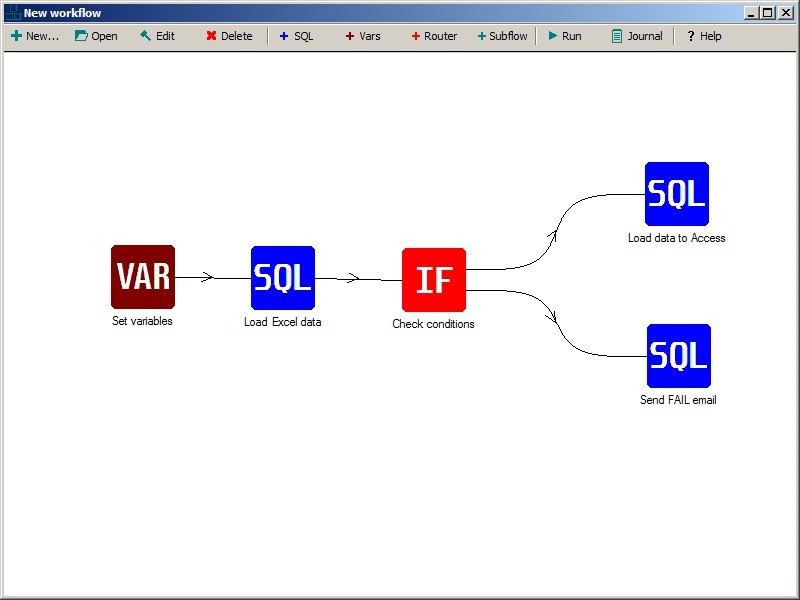

**IMPORTANT: App is not production-ready**  
SQLite Workflow Manager is a small sql-ish [ETL tool](https://en.wikipedia.org/wiki/Extract,_transform,_load) to run parametrized queries. 
This project is a part of [**sqlite-gui**](https://github.com/little-brother/sqlite-gui). Recent binaries are available at [sqlite-gui releases page](https://github.com/little-brother/sqlite-gui/releases) (with -wf suffix). 
Visit [**Wiki**](https://github.com/little-brother/sqlite-wf/wiki) to learn more.  

If you have any problems, comments or suggestions, just let me know <a href="mailto:lb.im@ya.ru?subject=sqlite-wf">lb.im@ya.ru</a>.